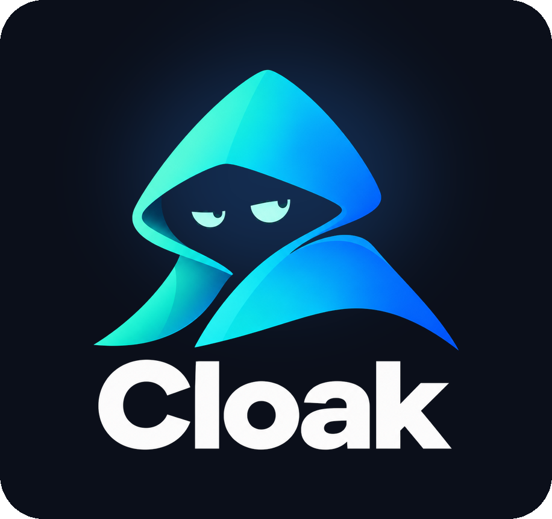

<p align="center">
  
</p>

<h3 align="center">A browser for your AI agent that big websites don't block, and that stays logged in.</h3>

<p align="center">
  <a href="https://www.youtube.com/watch?v=f7Eef8COJt8"></a>
</p>

<p align="center"><a href="https://www.youtube.com/watch?v=f7Eef8COJt8">Watch the video</a> · <a href="https://jonclegg.github.io/cloakroom/">Project page</a></p> <!-- pragma: allowlist secret -->

## Install

Tell your agent (Claude Code, Codex, Cursor, Grok, and so on):

```text
Install Cloakroom from https://github.com/jonclegg/cloakroom
```

That's it. Your agent will:

1. **Install Cloakroom** on your Mac, Linux, or Windows computer.
2. **Ask before installing Docker**, if your computer doesn't have it yet.
3. **Open a page for your OpenRouter key.** Cloakroom's built-in agent uses it to drive the browser. You paste the key into that page on your own computer, never into the chat. Get one at [openrouter.ai/keys](https://openrouter.ai/keys).
4. **Prove it works.** Cloakroom visits Amazon, Walmart, Target and Best Buy the way a person would, and shows you a screenshot of each.

## Use it

Ask your agent to do things on websites "with Cloakroom", for example: *"With Cloakroom, find a 12-cup coffee maker under $50 on Walmart."* Cloakroom drives a real browser on your computer, works through bot checks, and remembers your logins between sessions.

Ask your agent to share a link to the Cloakroom console: every session it is running, the live browser, and anything that needs you, from your phone or any computer.

## Good to know

- **Sign in yourself.** When a site needs a password, Cloakroom stops and your agent sends you a private link to the browser, so you can sign in from your phone or any computer. Don't paste passwords into the chat. Your agent can type in texted sign-in codes for you.
- **It runs on your computer.** Traffic leaves from your own internet connection, and nothing is reachable from outside unless you share the console link. Anyone who has that link can control your logged-in browser, so keep it private.
- **The details** for agents and the curious are in [AGENTS.md](AGENTS.md) and [the agent guide](skills/cloakroom/SKILL.md). The browser is [CloakBrowser](https://github.com/CloakHQ/CloakBrowser), run from [this fork](https://github.com/jonclegg/CloakBrowser/tree/cloakroom-fixes).

## License

Cloakroom's own code is [MIT licensed](LICENSE). The CloakBrowser binary belongs to CloakHQ and has its own [Binary License](https://github.com/CloakHQ/CloakBrowser/blob/main/BINARY-LICENSE.md). Cloakroom's image doesn't include it: your container downloads it from CloakHQ the first time it starts. See [NOTICE](NOTICE). Cloakroom is an independent community project, not affiliated with CloakHQ or any site mentioned here.
