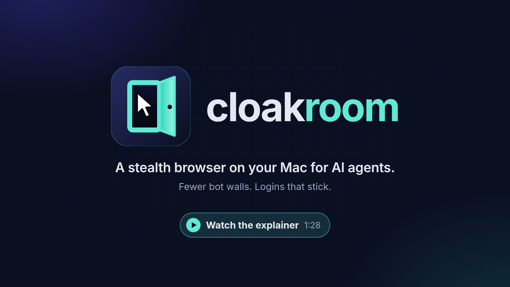

<p align="center">
  <picture>
    <source media="(prefers-color-scheme: dark)" srcset="docs/brand/cloakroom-logo-dark.svg">
    
  </picture>
</p>

**A stealth browser for AI agents: fewer bot walls, and logins that stick.**

[](docs/media/cloakroom-explainer.mp4)

Watch the [explainer video](docs/media/cloakroom-explainer.mp4) (1:28), or see the [project page](https://jonclegg.github.io/cloakroom/). <!-- pragma: allowlist secret -->

## Quickstart

Tell your agent (Grok Bot, Muse, Cursor, Claude Code, Codex) to install Cloakroom, or run it yourself.

macOS or Linux:

```bash
curl -fsSL https://raw.githubusercontent.com/jonclegg/cloakroom/main/install.sh | sh # // pragma: allowlist secret
```

Windows (PowerShell):

```powershell
irm https://raw.githubusercontent.com/jonclegg/cloakroom/main/install.ps1 | iex # // pragma: allowlist secret
```

- **Mac:** uses OrbStack, or a Docker engine you already run (Docker Desktop, Colima). With neither, it installs OrbStack (macOS 14+). Apple Silicon and Intel.
- **Linux (amd64 or arm64):** needs [Docker Engine](https://docs.docker.com/engine/install/) and the Compose plugin working for your user. If anything's missing, the installer says exactly what and how to fix it.
- **Windows:** needs [Docker Desktop](https://docs.docker.com/desktop/setup/install/windows-install/) running Linux containers (WSL 2).
- **Updating:** run the same command again. Your settings in `.env` are kept, and the previous copy is saved in `~/.cloakroom/app.previous`.

Or just hand your agent this repo's URL. It reads the instructions here and handles the rest.

## Why Cloakroom

Cloud agents browse from datacenter servers. Big sites see a datacenter IP and an automated browser, and they put up a bot wall. Every session also starts fresh, so the login from yesterday is gone today.

Cloakroom brings the browser home. It runs [CloakBrowser](https://github.com/CloakHQ/CloakBrowser), a stealth build of Chromium, on your Mac (OrbStack) or a Linux computer (Docker Engine) with one saved profile. Your agent drives it over CDP from wherever it runs.

How the agent drives it matters too. It enters each site from a Bing search result, moves the mouse and types like a person, and searches with the site's own search box. Starting at Google, or jumping straight to a hot search URL, is what tends to bring up a puzzle. Humanized input avoids needless challenges. It doesn't solve them: when a puzzle shows up, you finish it in the viewer.

## What you get

- **Harder to detect.** A stealth browser on your own connection, not an automated browser in a datacenter.
- **Sessions that persist.** Sign in once. Cookies and logins stay in the profile across runs and restarts.
- **You can watch and help.** Open the live viewer on this computer, or have your agent run `cloakroom share` to get a private link for your phone. Click, type, or sign in when the agent gets stuck.
- **Standard CDP.** Playwright, Puppeteer, or anything else that speaks the Chrome DevTools Protocol connects to `127.0.0.1:9222`. No SDK.

**Proof:** on September 26, 2026, a cloud browser was blocked on twelve big homepages (Home Depot, Ticketmaster, Sam's Club, and others). Cloakroom loaded all twelve.

The explainer also shows real screenshots: Google's `/sorry/` page after Google-first automation, Alibaba's slider after loading its search URL directly, and Alibaba's results after entering through Bing and searching with humanized input. They're in [`docs/media/evidence`](docs/media/evidence).

## Text-message codes (2FA)

When a site texts you a sign-in code, **your agent handles the code, not Cloakroom.** Cloakroom doesn't read your texts or iMessage, and it doesn't catch codes automatically. It gives you the browser where the code goes.

1. Your agent (Grok Bot, Muse, Cursor, and so on) gets the code. It might read it from Messages on your Mac or from your email.
2. The agent types the code into the sign-in page in Cloakroom.
3. If the agent can't get the code, you type it yourself in the viewer, or on your phone using a `cloakroom share` link. Don't paste codes into the chat.

Because the profile keeps its cookies, most sites ask for a code only on the first sign-in, and later sessions usually skip it. Agents will find the details in [the agent guide](skills/cloakroom/SKILL.md).

## Good to know

- No guarantees. Some sites will still block you, and Cloakroom doesn't solve CAPTCHAs.
- Your IP still matters. Traffic leaves from this computer's connection, or from a proxy you set.
- Only this computer can reach the browser. `cloakroom share` is the one way in from elsewhere, and it exposes only the viewer. Anyone with that link can control your logged-in browser, so keep it private and run `cloakroom unshare` when you're done.
- The full reference for agents (and the curious) is in [AGENTS.md](AGENTS.md) and [the agent guide](skills/cloakroom/SKILL.md).

## License

Cloakroom's own code is [MIT licensed](LICENSE). The CloakBrowser binary inside the official image belongs to CloakHQ and has its own [Binary License](https://github.com/CloakHQ/CloakBrowser/blob/main/BINARY-LICENSE.md). See [NOTICE](NOTICE). Cloakroom is an independent community project, not affiliated with CloakHQ or any site mentioned here.
